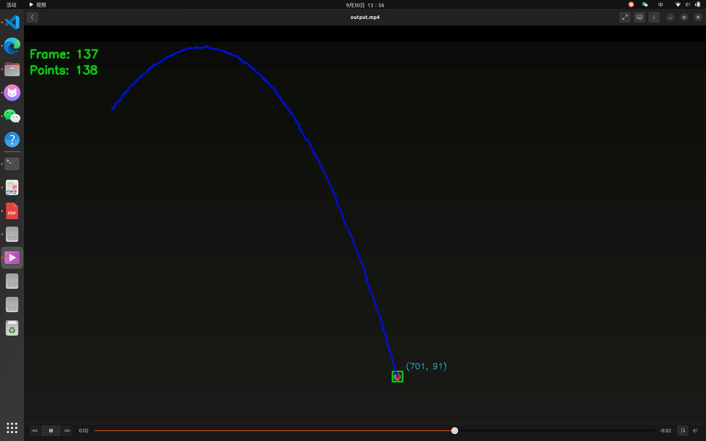

# 第三次培训任务

## 项目概述

基于OpenCV和Ceres Solver的弹丸轨迹参数拟合系统，从视频中提取小球运动轨迹并拟合物理参数。

## 开发环境

- **操作系统**：Ubuntu22.04.6
- **编程语言**：C++17
- **开发库**：OpenCV4.9.0

## 文件结构

```
TASK_03/
├── CMakeLists.txt
├── src/
│   └── extract_ball_data.cpp
├── README.md
├── video/
│   └── video.mp4
│   └── output.mp4
└── build/   └──建立/   └──建立/   └──建立/
```

## 实现思路

### 1. 小球检测与分割

**颜色空间选择：**
- 使用HSV颜色空间而不是RGB，因为HSV对光照变化更鲁棒
- 蓝色小球的HSV范围：H(90-140), S(90-255), V(0-255)

**检测流程：**
```
读取视频帧 → BGR转HSV → 颜色阈值分割 → 形态学处理 → 轮廓检测 → 中心点计算
```

**关键技术细节：**
- **阈值分割**：`cv::inRange()` 创建二值掩码，只保留蓝色区域
- **形态学处理**：
  - 开运算（先腐蚀后膨胀）：去除小噪声点
  - 闭运算（先膨胀后腐蚀）：填充小空洞，连接断裂区域
- **轮廓分析**：找到最大连通区域，计算外接矩形中心点作为小球位置
- **连续性检查**：过滤异常跳动点，确保轨迹平滑

### 2. 坐标系转换

**图像坐标系 → 物理坐标系：**
- 图像坐标系：原点在左上角，y轴向下
- 物理坐标系：原点在左下角，y轴向上（符合物理直觉）
- 转换公式：`y_physics = image_height - y_image`

### 3. 物理建模

**带空气阻力的弹道方程：**
```
x(t) = x₀ + (vₓ₀/k) × (1 - e^(-k×t))
y(t) = y₀ + (v_y₀ + g/k)/k × (1 - e^(-k×t)) - (g/k) × t
```

**参数物理意义：**
- `vₓ₀, v_y₀`：初始速度分量（像素/秒）
- `g`：重力加速度（像素/秒²）
- `k`：空气阻力系数（1/秒）

**模型特点：**
- 考虑了空气阻力的指数衰减效应
- 当k→0时退化为理想抛体运动
- 时间t=0时，速度即为初始速度

### 4. 参数拟合优化

**优化问题构建：**
- 目标：最小化预测位置与实际位置的差异
- 损失函数：∑[ (x_obs - x_pred)² + (y_obs - y_pred)² ]
- 优化变量：[vₓ₀, v_y₀, g, k]

**Ceres Solver配置：**
```cpp
// 自动求导，避免手动计算雅可比矩阵
ceres::AutoDiffCostFunction<TrajectoryResidual, 2, 4>

// 参数边界约束
problem.SetParameterLowerBound(params, 2, 100.0);   // g_min问题。SetParameterLowerBound(params, 2,100.0)；/ / g_min问题。SetParameterLowerBound(params, 2,100.0)；// g_min问题。SetParameterLowerBound（params, 2,100.0）
problem.SetParameterUpperBound(params, 2, 1000.0);  // g_max问题。SetParameterUpperBound(params, 2,1000 .0)；/ / g_max问题。SetParameterUpperBound(params, 2,1000 .0)；// g_max问题。SetParameterUpperBound（params, 2,1000 .0）
problem.SetParameterLowerBound(params, 3, 0.01);    // k_min问题。SetParameterLowerBound(params, 3, 0.01)；/ / k_min
problem.SetParameterUpperBound(params, 3, 1.0);     // k_max问题。SetParameterUpperBound(params, 3, 1.0)；/ / k_max

// 使用稠密QR分解求解
options.linear_solver_type = ceres::DENSE_QR;选项。linear_solver_type = ceres::DENSE_QR；
```

**优化过程：**
1. 为每个轨迹点创建残差块
2. Ceres自动计算梯度方向
3. 迭代更新参数直至收敛
4. 输出最终参数和拟合误差

### 5. 数据流与处理流程

```
视频输入
    ↓
帧读取 → 小球检测 → 坐标记录
    ↓
轨迹数据收集 (t, x, y)
    ↓
物理坐标系转换
    ↓
Ceres参数优化
    ↓
结果验证与可视化
```

### 6. 关键技术难点解决

**小球检测稳定性：**
- 多帧连续性检查，过滤异常检测
- 面积阈值过滤，排除小噪声
- 形态学操作增强检测鲁棒性

**拟合收敛性：**
- 合理的初始参数估计（基于物理直觉）
- 参数边界约束避免不合理解
- 足够的轨迹点数量保证拟合精度

**数值稳定性：**
- 使用`ceres::exp()`避免数值溢出
- 参数归一化处理
- 异常值检测与处理

### 7. 结果验证方法

**拟合质量评估：**
- 平均位置误差（像素）
- 轨迹形状匹配度
- 参数物理合理性检查

**可视化验证：**
- 实际轨迹点 vs 拟合曲线对比
- 残差分布分析
- 参数收敛过程监控

### 结果

- === FITTING RESULTS ===   ===拟合结果===
- Initial velocity X: 252.975 px/s初速度X: 252.975 px/s
- Initial velocity Y: 346.062 px/s初速度Y: 346.062 px/s
- Gravity: 497.3 px/s²   重力：497.3 px/s²
- Drag coefficient: 0.065969 1/s阻力系数：0.065969 1/s
- Average fitting error: 1.31329 pixels平均拟合误差：1.31329像素


